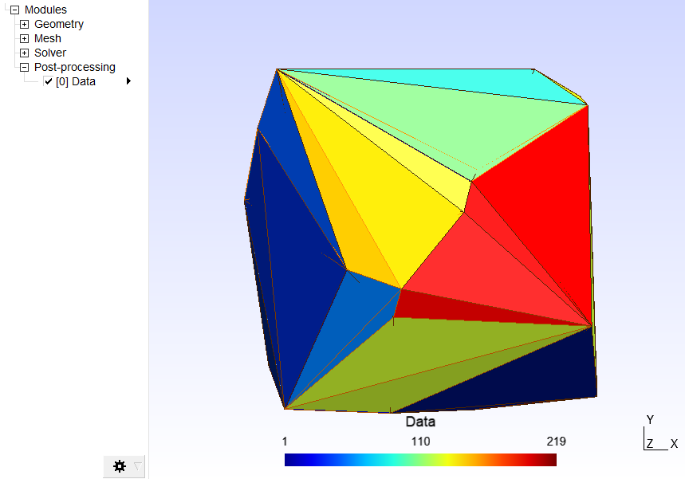
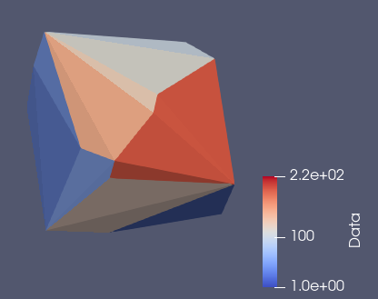

# meshio2matlab

Matlab ❤ Meshio

[Meshio](https://github.com/nschloe/meshio) is a great python library which can read, write and convert unstructured mesh formats. Matlab doesnt have the same support, but through the python interface it is possible to take advantage of Meshio, and prevent having to write and maintain lots of separate I/O functions.

## Requirements

- Python install that [Matlab is happy with](https://www.mathworks.com/help/matlab/matlab_external/system-and-configuration-requirements.html)
- [Meshio](https://github.com/nschloe/meshio) - `pip install meshio[all]`
- Matlab >2014b

This has only been tested on Matlab 2019b with Python 3.8.3

## Usage

### Read file

```matlab
P=meshio.read(fname); % .msh .vtk .vtu .stl .obj TetGen ANSYS ...

% P.vtx             - verticies
% P.Cells           - structure array for each geometry saved in file
% P.Cells.tri       - Trigangulation connectivity list for this cell
% P.Cells.type      - 'Tetra','Triangle','Line','Vertex'
% P.cell_data       - Per element data in cell array
% P.cell_data_name  - Data names in cell array
% P.point_data      - Per point data in cell array
% P.point_data_name - Data names in cell array

% all contents can be plotted using:
meshio.plot(P);
```

### Write file

```matlab
% random triangulation
x = rand(50,1);
y = rand(50,1);
z= rand(50,1);
dt = delaunayTriangulation(x,y,z);
dataex=1:size(dt.ConnectivityList,1);

%write to gmsh file with cell data
meshio.write('example.msh',dt.Points,dt.ConnectivityList,{dataex},{'Data'});
```

This can then be loaded directly into [gmsh](https://gmsh.info/)


or into paraview (either by writing to .vtu or loading .msh using meshio paraview plugin)



### Convert file

Conversion through `meshio-convert` binary is harder to fit into matlab workflow, so this library can be used too

```matlab
P=meshio.read('example.msh');
meshio.structwrite('example.vtu',P);
```
